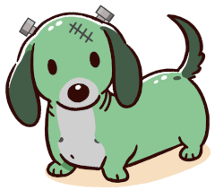

# Santa's Little Helper - One to rule them all



## Build requirements

* PHP >= 8.3
* composer
* humbug/box: `composer global require humbug/box`

## Build locally

Install composer packages

```
composer install
```

Check installation

```
composer run doctor
```

Prepare/download static-php (`.cache/`)

```
composer run build:prepare
```

Build phar file - required for static-php

```
composer run build:phar
```

Build static-php standalone binary

```
composer run build:standalone
```

Once this was successful, `composer run build` will rebuild
the entire phar and binary.

## Webserver

```
./bin/frankenphp run -c ./templates/Caddyfile --envfile .env
```